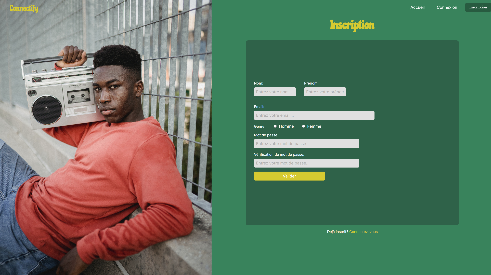

# Connectify

Connectify is a modern, responsive social network web application designed to let users create personalized profiles, share messages, images, GIFs, and music, and interact in real-time. Inspired by classic social platforms, it emphasizes an intuitive interface and secure user management with Firebase.

## Features

- **Authentication**: Secure sign-up and login with email/password (Firebase Authentication).
- **User Profile**: 
  - Custom banner with name/surname.
  - Dedicated sections: Message Wall (text/images), Image Gallery, Video/GIFs, Music (MP3).
- **Real-Time Interactions**: Add/remove content (messages, images, GIFs, music) via Firebase Realtime Database.
- **Public Pages**: Homepage with news sections and newsletter form, contact page for sending messages.
- **Responsive Design**: Mobile/tablet adaptation with styled-components and media queries.
- **Validation**: Client-side form validation (email, password).

## Technologies Used

- **Frontend**: React 19.0.0 (components, hooks), react-router-dom 6.23.0 (SPA routing).
- **Styling**: styled-components 6.1.15 (CSS-in-JS), Google Fonts (Chicle, Inter).
- **Backend**: Firebase 11.5.0 (Authentication, Firestore for user/contact data, Realtime Database for real-time content, Storage configured but unused, Analytics optional).
- **Build & Dev Tools**: Webpack 5.98.0 (bundling), Babel 7.26.x (ES6+/JSX transpilation), Jest 29.7.0 (testing), ESLint 9.22.0 (linting), Prettier 3.5.3 (formatting).
- **Containerization**: Docker (dev/prod images based on node:20-alpine).
- **Others**: dotenv (environment variables), serve 14.2.4 (static server for prod).

## Prerequisites

- Node.js 20+.
- Git with SSH configured.
- Free Firebase account.
- Docker (optional, for containerization).

## Arborescence

## Installation and Running (From Scratch)

### 1. Clone the Project
git clone git@github.com:hayashiart/Connectify.git
cd Connectify

### 2. Install Dependencies
npm install

### 3. Configure Firebase
1. Create a Firebase project named "siteconnectify" on https://console.firebase.google.com.
2. Enable Authentication (email/password), Firestore (test mode), Realtime Database (test mode), and Storage (test mode).
3. Add a web app (icon "</>"), copy the `firebaseConfig` object.
4. Create a `.env.local` file at the root:
   touch .env.local
   Add the following content (replace with your `firebaseConfig` values):
   REACT_APP_FIREBASE_API_KEY=your_api_key
   REACT_APP_FIREBASE_AUTH_DOMAIN=siteconnectify.firebaseapp.com
   REACT_APP_FIREBASE_PROJECT_ID=siteconnectify
   REACT_APP_FIREBASE_STORAGE_BUCKET=siteconnectify.appspot.com
   REACT_APP_FIREBASE_MESSAGING_SENDER_ID=your_sender_id
   REACT_APP_FIREBASE_APP_ID=your_app_id
   REACT_APP_FIREBASE_MEASUREMENT_ID=your_measurement_id
   REACT_APP_FIREBASE_DATABASE_URL=https://siteconnectify-default-rtdb.firebaseio.com

### 4. Run the Application
- **Development Mode** (auto-reload):
  npm start
  - Opens http://localhost:3000.

- **Production Mode** (optimized, for testing):
  npm run build
  npx serve -c serve.json dist
  - Opens http://localhost:5000.

### 5. Run with Docker (Optional)
- **Development**:
  docker build -f Dockerfile.dev -t connectify-dev .
  docker run -p 3000:3000 -v $(pwd)/.env.local:/app/.env.local connectify-dev
  - Opens http://localhost:3000.

- **Production**:
  docker build -f Dockerfile.prod -t connectify-prod .
  docker run -p 3000:3000 connectify-prod
  - Opens http://localhost:3000.

### 6. Deploy to Firebase Hosting
npm install -g firebase-tools
firebase login
firebase init hosting  # Select "dist" as public directory
npm run build
firebase deploy --only hosting
- Opens the provided URL (e.g., https://siteconnectify.web.app).

## Project Structure
See the image [project_structure.png](project_structure.png) for the full directory tree.

## Useful Scripts
- `npm test`: Run unit tests (Jest).
- `npm run lint`: Analyze code (ESLint).
- `npm run format`: Format code (Prettier).

## Contributing
Fork the repo, create a branch, commit, and open a PR. Follow ESLint/Prettier rules.

## License
ISC License. See [LICENSE](LICENSE) (add a file if absent).

## Support
Contact hayashiart on GitHub for questions.